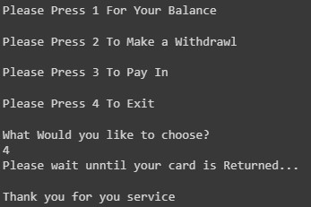

# ATM Transaction 
This sysstem include all the process likhe withdrawl ,Pay-In and enquire aboot the balance.

We have to entered the 4 digit correct password for the following process i.e. for the transaction. 
There are 4 option for the user 
1. Please Press 1 For Your Balance 
2. Please Press 2 To Make a Withdrawl 
3. Please Press 3 To Pay In 
4. Please Press 4 To Exit 

<h3> Balance enquire</h3>
  To know the current amount in bank 
 
  
<h3> Withdrawl </h3>
  To withdraw money from ATM 

  
<h3> Pay-In</h3>
  To deposit money  

  
<h3> Exit </h3>
  Leave or exit 

